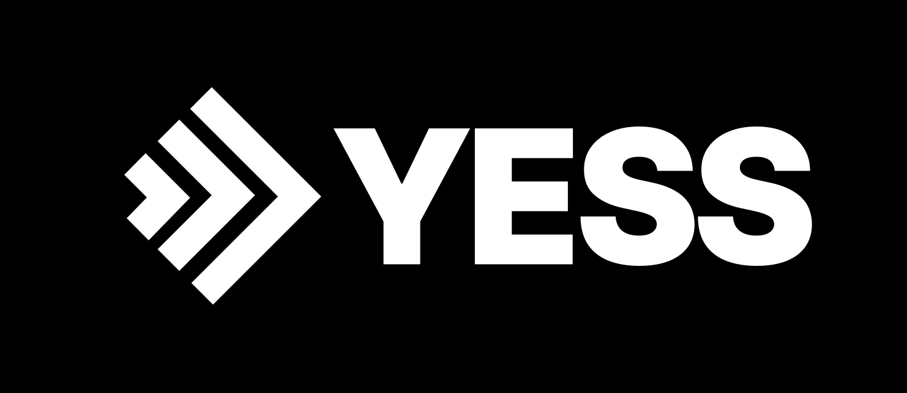

# YESS: A Reboot Of RSS

**STATUS**: This document is a draft specification. A number of supporting libraries are currently under development, as well as a YESS reader + builder app known as *Direct*.

## Summary

This document describes a new media syndication protocol, called the *YESS* protocol, which can be thought of as both a natural successor as well as a radical reformation of RSS. YESS stands for *You Easily Syndicate Scenes*. The protocol is largely about splitting static HTML up into small single-screen components, called *Scenes*. Scenes can be mixed and matched to create rich multi-screen web experiences which are ultimately syndicated to end-users. The overarching goal of this protocol is to unseat the social media platforms as the dominant means of media syndication. It attemps to bring the internet back to its original roots of being a decentralized information exchange technology without centralized points of control.

## History Of RSS

The RSS protocol was invented in 1999 as a way for journalists to syndicate content directly to their audiences. According to Dave Winer, one of RSS's inventors, the appeal of RSS was that it allowed individuals to "retain full control over their online personae".

By 2005, the protocol was beginning to achieve mainstream adoption, with major publications such as the New York Times beginning to offer their content in RSS format. However, due to shifts in technology, paired with flaws in the design of RSS itself, RSS began to lose its appeal.

Today RSS rests as an obscure protocol, and the demand for content syndication has been mostly filled by social media. This is unfortunate, as social media platforms have become notorious for committing abuses against users in their quest to maximize ad revenue, seemingly by any means necessary. The list of abuses are seemingly endless: intentionally trying to get the public (especially youth) addicted to degenerative content, censoring controversial ideas, spying on users, excessive harvesting of their private personal information, and more.

## Learning From The Past

There are numerous reasons why the RSS technology failed to become the dominant means of media distribution. It is worth articulating these failures here in order to lay a foundation that avoids making the same mistakes again.

**It was built to syndicate the wrong kind of content**. RSS was built to syndicate long-form text articles, such as the type of content found in newspapers. This certainly has a place. But as the mobile revolution took place, market demand shifted towards short-form bite-size content that could be consumed intermittently while on the go.

**It only had email for inspiration**. There's a reason RSS readers all felt like email clients. The only widely adopted dissemenation technology that came before RSS was email. The concept of *scrolling a feed* wasn't a well understood construct at the time. 

**It tried to compete with HTML**. This is a mistake that few people seem to acknowledge. RSS's XML format is largely a web-based presentation layer, and an anemic one at that. Every web-based presentation layer that has tried to compete with HTML has failed (Java Applets, Flash, Silverlight).

**The standardization group suffered from constant in-fighting**. Because it was a presentation layer, the standardization group ended up fighting over trivialities such as whether bulleted lists should be included, instead of addressing larger issues such as analytics collection and monetization concerns.

**It was the worst of both worlds between email and the web**. Publications could either drive traffic to their website, where they could provide rich user experience, adhere to brand guidelines, collect analytics, and ultimately drive monetization. Or, they could drive their audience to subscribe to their newsletter, which doesn't have quite the same richness or analytics, but has very rich segmentation and the content could personalized to each user, and drive monetization that way. Or they could send traffic to their RSS feed, which did neither of these things, and worked against the publications monetization interests.

**Google discontinued Google Reader**. Google Reader had significant market share of the RSS Reader space, and so the discontination of this product was a crippling blow to the protocol. Google's stated reasons for this decision was because of dying interest in the product and RSS in general. One could take the conspiratorial path and speculate about the fact that the decentralized nature of RSS is at odds with Google's business model of consolidating their control over data. **(COMMENT REQUESTED: Can someone from Google add insight?)** 

**(COMMENT REQUESTED: Are there other key reasons why RSS failed? )**


## Design Goals

**The YESS specification ought to be as narrow as possible**. Large, bloated specifications make concensus difficult and increase the likelihood of fueling internal politics.

**Manage the balance between privacy and monetization**. While YESS aims to be _vastly_ more privacy concious than the experience found on social media platforms, it is important to stress that *strict privacy purism* is not a goal. Creators must be able to collect insights into the consumption habits of their audience in order to produce quality content, drive monetization, and continue to invest in the protocol. Placing too high a value on privacy pushes away creators. Ironically, this results in less overall privacy, as the protocol fails and the major social platforms remain dominant.

**Static file servers must be sufficient for distribution**. The second specialized server software is required to be installed on a machine to even get started, the technology becomes much harder to adopt, especially for less technical users. Special software may be required to support YESS's analytics collection features.

**Welcome HTML & CSS. Shun arbitrary JavaScript**. HTML & CSS are ubiquitous and powerful. Inventing a new presentation layer is a fools errand. However, arbitrary JavaScript–which is script that is provided by the creator rather than the protocol itself–will turn YESS into everything that's wrong with today's web–irritating popovers,  tracking scripts, performance-destructive banner ads, UI patterns that don't translate to mobile, etc.

**Anticipate pre-processors**. Don't add things to the specification that could otherwise be done with a preprocessor. Pre-processors and generation tools are abundant across all of the major web presentation technologies (HTML, CSS, JavaScript, SVG). YESS will be no different.


# Overview

YESS is a protocol for describing the format of various static files that form a web page with a specific format. The web page is divided into *Scenes*. A *Scene* is a block of content whose height is at least the height of a single screen of the user's device. Each Scene of the web page can be swiped through sequentially. The sequential scene-swipe progression is composed by the user agent merging together one or more Scene  files. When the end of the scene progression is reached, there exists a *List* file which contains pointers to other suggested content.

## Trailer HTML Files

*Trailer* files contain the first scene of the (named "index.html"). The general format of Trailer index.html files are as follows:

```html
<!doctype html>
<title>...</title>
<!--
YESS-specific <meta> tags
-->
<meta name="yess-suggest" content="...">
<meta name="yess-story" content="...">
<meta name="yess-cut" content="...">
<meta name="yess-ping" content="...">
<!--
Typical information found in the <head> element of an HTML page
should be placed here.
-->

<!--
There's no <body> tag.
Instead, trailer files have a single top-level <section> tag.
-->
<section>
	...
</section>
```


### The `yess-suggest` Meta Tag

Specifies the location of the suggestions file whose contents are encouraged to be displayed alongside this page. If this meta tag is omitted, no follow-up options are displayed.

```html
<meta name="yess-suggest" content="/some/path/suggest.txt">
```

Alternatively, the content attribute may be omitted, which instructs the YESS reader to request a file called `suggest.txt` in the same location as the displaying page:

```html
<meta name="yess-suggest">
```

The `yess-suggest` meta tag can contain multiple suggestions files, if they are separated by the `;` character. In this case, the suggestions from each file are merged sequentially into a single suggestions list.

```html
<meta name="yess-suggest" content="suggestions-1.txt; suggestions-2.txt">
```

YESS introduces the notion of *client-side segmentation*, which is covered in more depth in a following section of this document. The `yess-index` attribute can specify a client-side segmentation value, using the `if` sub-attribute. The user agent should detect if the segmentation condition applies, in which case, the suggestions from the specified URL will be included.

```html
<meta name="yess-suggest" content="suggest.txt, if=segment">
```

The format of the suggestions file is documented below under *Suggest Files*.


### The `yess-story` Meta Tag

Specifies the location of the file that contains the scenes that will be added after the trailer scene.

```html
<meta name="yess-story" content="/path/to/story.html">
```

Alternatively, the `content` attribute can be omitted, in which case, a file called `story.html` is requested at the same location as the loaded trailer HTML file.

```html
<meta name="yess-story">
```


### The `yess-cut` Meta Tag

The `yess-cut` meta tag is used to inject outside scenes into the story. This feature is intended to support injection of various interstitial scenes that are reused across many pages, such as calls to action or sponsorship messages.

The structure of the `yess-cut` attribute is as follows:

```html
<meta name="yess-cut" content="[url], at=[position], if=[condition]">
```

**[url]**
**Required**. Defines a path to the HTML file whose scenes should be injected. The URL is relative to the current URL. If the path contains space characters, they must be URL-encoded.

**at=[position]**
**Optional**. Defines the position of the scene within the story to insert the new scenes. Negative numbers are accepted, which inserts the scene at an index counting from the end of the story. If omitted, the scene is inserted at the end of the story.

The trailer scene is not considered when determining the insertion position of a scene. The trailer scene is always first. All scene insertion occurs before the trailer. Therefore, the 0th position is considered to be the position *after* the trailer.

**if=[conditition]**
**Optional**. Only executes the operation when the client is determined to be a member of client-side segment. See Client-Side Segmentation for more information on how to establish segments and conditions. If omitted, the insertion is always executed.

The URL subattribute must come first, but the successive attributes may come in any order.

Some complete examples of `yess-cut` tags are as follows:

```html
<meta name="yess-cut" content="../index.html, if=subscriber">
<meta name="yess-cut" content="../index.html, if=subscriber, at=-1">
<meta name="yess-cut" content="../index.html">
```

**Multiple cuts can be defined** on the same story by separating the attributes with the `;` character. In this case, multiple cut scnes will be inserted as would be expected. It is important to note however, that the insertions occur **all at once** rather than **sequentially**, meaning that inserting a scene at an earlier point in the progression does not impact the index numbers. For example, consider a story with 5 scenes (excluding the trailer) that defines the following insertions in the form:

```html
<meta name="yess-cut" content="
	../a.html, at=0;
	../b.html, at=4">
```

The above will result in a scene progression such as:

1. Trailer scene
2. Scene or scenes defined within *a.html*
3. Scene from 0.html
4. Scene from 1.html
5. Scene from 2.html
6. Scene from 3.html
7. Scene from *b.html*
8. Scene from 4.html


### The `yess-ping` Meta Tag

YESS introduces the notion of sending *Pings* to a specific URL in response to user-triggered events. The `yess-ping` meta tag specifies the base URL where pings are send. More information about pings is included below.

```html
<meta name="yess-ping" content="https://www.analytics.com/path">
```

The URL may not specify a query string value (`?a=b`) or a fragment (`#`)

## Scene HTML Files

Scene HTML files have one or more HTML `<section>` tags at the top level of the document. The contents within each `<section>` tag represents a separate scene.

```html
<section>
	HTML for section 1
</section>
<section>
	HTML for section 2
</section>
<section>
	HTML for section 3
</section>
```

Content outside of the root-level section tags must be ignored by the user agent. This can be useful in order to make the scene HTML files independently loadable, for example, by adding a `<!doctype>` declaration at the top or an HTML `<head>` section.

## Ignored HTML Tags

All HTML tags are permissable for use in YESS documents, with the exception of those listed below. If any of the tags listed below are found in a YESS document, they must be ignored by user agents, as well as any children nested within them:

- `<script>`
- `<iframe>`
- `<object>`
- `<embed>`
- `<portal>` (Not standardized, but ignored)


## Suggest Files

Suggest files are expected to be a plain-text file, where each line in the file is either a path to a suggested URL, or another Suggest file. The URLs specified in the suggestion file are relative to the location of where the suggestion file was loaded.

```
path/to/something
path/to/something/else
path/to/another/index.txt
```

Each URL that points to a suggestion is expected to be a URL to a trailer HTML file. This way, previews of the suggested content can be used for presentation purposes.

Lines in the suggest file can contain `if` attributes, using a syntax that is similar to the YESS meta tags:

```
path/to/something
path/to/something/else, if=customer
path/to/another/index.txt, if=customer
```


## Stream Files

In addition to the suggest files that are linked from the Trailer HTML, there also exists another type of suggest file called a *Stream File*. Stream files provide a way for the YESS reader to subscribe and automatically download a stream of updates found at some URL. Stream files have the identical format as suggest files.

Authors can provide a way to subscribe to YESS streams by pointing the browser to a URL that uses the `yess://` protocol URI scheme. The format of this URI scheme is as follows:

```
yess://[relative-path-to-stream-file.txt]
```

The URL of the stream is required to end in `.txt`. If it does not, there is undefined behavior around how meta information associated with the stream is discovered.

A concrete example of a clickable subscription link could look like:

```html
<a href="yess://../stream.txt">Subscribe to my YESS feed</a>
```

These links can exist anywhere in YESS content. They can also be embedded within any web page, which requires the user to have a YESS reader installed in order to recognize the `yess://` scheme.

This design allows authors to provide one-click subscribe to many different YESS streams all in the same location:

```html
<a href="yess://fishing.txt">Subscribe to my fishing YESS feed</a>
<a href="yess://cooking.txt">Subscribe to my cooking YESS feed</a>
```

Authors can point to YESS streams to recommend other YESS streams that exist on other domains:

```html
<a href="yess://https://alice.com/knitting.txt">Subscribe to Alice's knitting YESS feed.</a>
```

## Transferring Context

There exists the case where a user could take a variety of actions which generate segmentation data, then choose to subscribe to a particular stream, and then continue consuming content within their YESS reader. In this case, the segmentation data would be lost when making the jump from the web browser into the YESS reader.

In order to handle this case, the URI provided in the `yess://` protocol scheme may be appended with a query string value, whose format is equal to the query string format used in Ping operations (see the *Ping* section below.)


## Polling For Updates

Periodically, the YESS reader executes an HTTP `HEAD` request on the URL of all stream files to which the user has subscribed. The reader compares the returned HTTP `Last-Modified` header, and/or the `Content-Length` header values from the last poll to determine if a full re-download of the index is necessary.

Some readers may optimize this re-download process. For example, some readers may use the HTTP `Range` header to only download the first `4kb` of data (which would be roughly 100 entries), and ignore all others.


## Avatars

Authors can associate an avatar with a stream, so that the YESS reader can provide a way for users to identify what content is coming from what author. These associations are done by having a `.jpg` image file adjacent to the stream text file, that shares the same base file name as the stream file.

For example, if a stream comes from the URL `http://example.com/stream.txt`, the YESS reader will request an avatar image from the URL `http://example.com/stream.jpg`.


# Client-Side Segmentation

## Concept

Client-side segmentation is an innovative technique of maintaining **strict user privacy** while simultaneously performing **rich analytics and targeting**. Additionally, the technique maintains **full compliance with GDPR** and CASL regulation while simultaneously not requiring authors to request permission to store tracking cookies. In short, client-side segmentation allows authors to do ***Targeting Without Tracking***.

In effect, client-side segmentation makes it possible to achieve the kind of **user-specific content specialization** that exceeds what is seen in the most advanced email marketing tools, except while collecting no personally identifiable information, user identifiers, or fingerprints, and without allowing authors to execute arbitrary JavaScript. 

Typical behavioral tracking and content specialization is done by developing a rich user profile on the server side, which is tied to a tracking cookie on the users device, which allows the server to deliver specialized content to the user.

With Client-side segmentation, no server makes any decision about what content to send to what user. Instead, the segmentation logic is embedded directly in the YESS content itself, and the YESS reader determines for itself how the content should be specialized for the user.

The technique provides a very simple way for authors to **set boolean flags** and adjust **small integers** in response to events, and transmit these values to a server. The only data the server can collect is:

- The user agent string
- An IP address
- The time at which the data was collected
- The page from which the data was collected (using the `HTTP_REFERER` header value)
- A series of flags and small integers that describe the actions taken by the user up until the point of transmission.

## YESS Expression Format

The implementation works by writing simple expressions into event handlers, that take the form of one or more `opcode.identifier` instances separated by the `;` character. White-space is not significant. This specification defines only 6 opcodes, which are documented below:

### set

Sets a boolean identifier if it has not already been set. 

```html
<a onclick="set.clicked">...</a>
```

### inc

Increments the value of an integer identifier, or creates a new integer with a value of 1 if no such tag exists

```html
<a onclick="inc.clicked">...</a>
```

### dec

Decrements the value of an integer identifier. Has no effect if no such identifier has been previously defined.

```html
<a onclick="dec.clicked">...</a>
```

### del

Deletes a previously set boolean or integer identifier.

```html
<a onclick="del.clicked">...</a>
```

### is

The `is` opcode is reserved for a namespace constants. This specification only defines a single constant, `bot`, which is most useful in allowing certain content to be hidden from bots.

```html
<section data-if="!is.bot">...</section>
```

### ping

A functional opcode that triggers a transmission of data to a server. The identifier is sent to the server along with the ping information so that any analytics tool can map the ping operation back to a place in the YESS source. See *Pings* below for more information.

```html
<section onload="ping.loaded">...</section>
```


## Examples

Reset a tag:

```html
<button onclick="del.tagname; add.tagname">Reset a tag</button>
```

Notify when a video starts playing:

```html
<video onstart="ping.start">...</video>
```

Notify when a video has completed:

```html
<video onfinish="ping.finish">...</video>
```


**(COMMENTS REQUESTED: Can GDPR and CASL experts provide insight into whether there could be compliance pitfalls with this design?)**


## Pings

The YESS protocol specifies a way to collect *Pings*, in response to user-triggered events. Pings are HTTP `HEAD` requests which are made to the URL specified in the `<meta name="yess-ping">` tag. The URL contains all of the data that has been collected for the user up until the point of the ping. This data is encoded in the querystring of the URL.

If we assume that the following data has been collected:

| Identifier | Type    | Value |
| ---------- | ------- | ----- |
| n1         | integer | 3     |
| n2         | integer | 4     |
| b1         | boolean | false |
| b2         | boolean | true  |

The format of the URL where the request is made is:

```
http://yess-ping-domain.ext/?ping-identifier&b2&n1=3&n2=4
```


## Conditional Expressions

The `if=` sub-attribute within the `content` attribute uses a simple expression format.


Applies when the `mybool` tag is true:

```html
<meta name="..." content="... if=mybool">
```

Applies when the `mybool` tag is false:

```html
<meta name="..." content="... if=!mybool">
```

Applies when the `mycount` tag is equal to 10:

```html
<meta name="..." content="... if=mycount 10">
```

Applies when the `mycount` tag is greater than 10:

```html
<meta name="..." content="... if=mycount > 10">
```

Applies when the `mycount` tag is less than 10:

```html
<meta name="..." content="... if=mycount < 10">
```

The left side must be an identifer, and the optional right side must be a literal numeric value. There is no less-than-or-equals or greater-than-or-equals operators. 

Logical AND is done by specifying having a compound statement:

```html
<meta name="yess-cut" content="
	../a.html, if=mycount < 10;
	../a.html, if=mycount > 20">
```

The `data-if=` attribute follows a similar format, may be placed on any element to conditionally display it based on a condition:

```html
<section data-if="mycount > 10">...</section>
```
